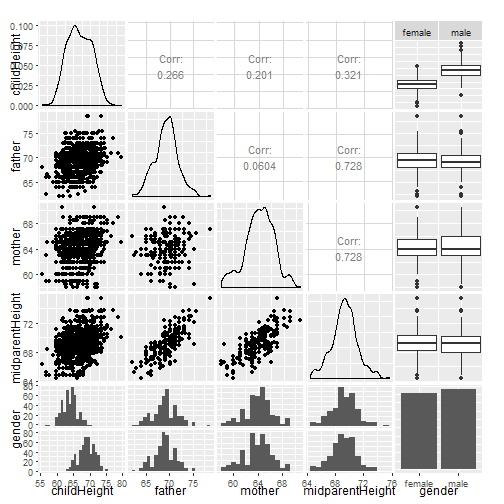

## Overview

We will work with the GaltonFamilies dataset, more information for this dataset can be found here [HistData](https://cran.r-project.org/web/packages/HistData/), this data product will predict the child height using the height of the parents and the gender of the child.

This developing data products assigment will ensure that we fully understand and use all the concepts related to:

* Shiny to build data product application.
* Slidify to create data product related presentations.

--- .class #id

## Loading and transforming the dataset


```r
library(HistData)
library(dplyr)
library(GGally)
library(ggplot2)

# Loading dataset
data("GaltonFamilies")

# Transform inches to cms
GaltonFamilies <- GaltonFamilies %>% mutate(fh=father*2.54,
                                            mh=mother*2.54,
                                            mph=midparentHeight*2.54,
                                            ch=childHeight*2.54)

# Fit different linear models for testing
model1 <- lm(ch ~ mph, data=GaltonFamilies)
model2 <- lm(ch ~ mph + gender, data=GaltonFamilies)
model3 <- lm(ch ~ fh + mh + gender, data=GaltonFamilies)
```


--- .class #id &twocol

## Correlation plot

*** =left



*** =right

We can see in the plots that the child's height is very correlated with the gender and heights of the parents.

--- .class #id

## Selecting the best linear model


```r
anova(model1, model2, model3, test = "F")
```

```
## Analysis of Variance Table
## 
## Model 1: ch ~ mph
## Model 2: ch ~ mph + gender
## Model 3: ch ~ fh + mh + gender
##   Res.Df   RSS Df Sum of Sq         F  Pr(>F)    
## 1    932 69171                                   
## 2    931 28284  1     40886 1352.4430 < 2e-16 ***
## 3    930 28115  1       169    5.5904 0.01826 *  
## ---
## Signif. codes:  0 '***' 0.001 '**' 0.01 '*' 0.05 '.' 0.1 ' ' 1
```

Here we can see that the best model is the one using `ch ~ fh + mh + gender`

--- .class #id

## Shiny application

The application allows the user to:

Select height of parents (mother and father) and gender of child. Make plot and give predicted height of child.

The Shiny App for this project can be found [Here](https://danielzuluaga.shinyapps.io/childHeight/)

GitHub repository for the project can be found [Here](https://github.com/ZuluagaSD/data-products)
